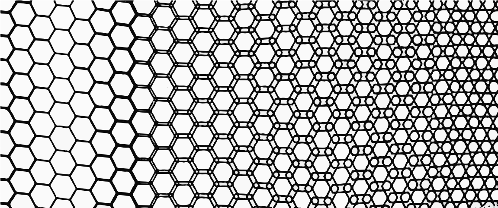
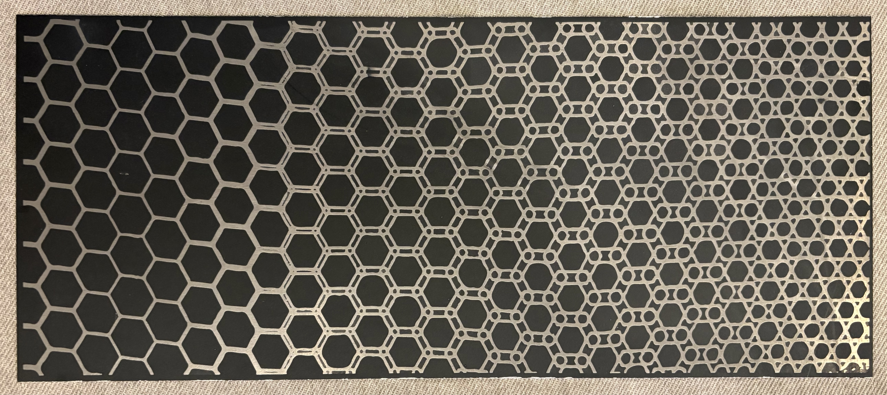

<html lang="en">
<head>
<meta charset="UTF-8">
<meta name="viewport" content="width=device-width, initial-scale=1.0">
<title>How Long Have You Been You?</title>
<link rel="preconnect" href="https://fonts.googleapis.com">
<link href="https://fonts.googleapis.com/css2?family=EB+Garamond:ital,wght@0,400;0,500;1,400;1,500&family=Cormorant+Garamond:ital,wght@0,300;0,400;1,300;1,400&family=Jost:wght@200;300;400&display=swap" rel="stylesheet">

</head>
<body>

<!-- SCROLL-ROTATING BACKGROUND -->

  

<!-- ── INTRO ── -->
<section id="intro">
  

    
  

  

    
Etched aluminum &nbsp;·&nbsp; 2026

    <h1>How Long Have You Been You?</h1>
    
A meditation on identity, continuity, and the strange persistence of the self across time.

    
Scroll to explore

  

</section>

<!-- ── MAIN SCROLLYTELLING AREA ── -->

  <!-- Desktop/tablet: sticky rotated strip on right -->
  

    

      

        
      

    

  

  <!-- Narrative panels -->
  

    

      

        
Origin

        <h2>You began as <em>one thing.</em></h2>
        

        
Look at a photograph of yourself as a child. The face is familiar, yet foreign. You share a body — a lineage of cells — with that small person. And yet you know something they do not, have been shaped by things they never experienced, carry losses they couldn't yet imagine.

        
Are you the same person?

      

    

    <!-- Mobile art strip: shows leftmost (simplest) portion -->
    

      
    

    

      

        
The past self

        <h2>Looking backward feels <em>obvious.</em></h2>
        

        
When we look behind us, the transformation seems natural. Of course we changed. We can trace the path: the formative years, the decisive moments, the slow accumulations. The journey from then to now feels legible — even inevitable.

        
We grant our past selves the permission to have been different.

      

    

    

      
    

    

      

        
The present self

        <h2>But now <em>feels fixed.</em></h2>
        

        
Something strange happens when we look forward. The future self — the person you will be in ten, twenty, forty years — feels like a continuation of who you are right now. We make plans for them, make sacrifices for them, as though they are us.

        
We assume our future self will want what we want now. Believe what we believe now. Be, essentially, who we are now.

      

    

    

      
    

    

      

        
The future self

        <h2>The pattern <em>keeps changing.</em></h2>
        

        
Research consistently shows that people underestimate how much they will change. Psychologists call this the "end of history illusion" — the persistent feeling that you have finally become the person you were always becoming, and that the story is now stable.

        
But the pattern never stops evolving. Complexity grows in ways you cannot yet see from where you stand.

      

    

    

      
    

    

      

        
Continuity

        <h2>And yet —  <em>still you.</em></h2>
        

        
The philosopher Derek Parfit spent his life on this question. He came to believe that personal identity is not what matters — that the thread connecting your past, present, and future selves is thinner than we imagine, and stranger.

        
And somehow, that thought is not frightening. It is freeing. To hold your past and future selves with a lighter grip. To let the pattern be what it is.

      

    

  
<!-- /scroll-narrative -->

<!-- /artwork-section -->

<!-- FULL ARTWORK REVEAL -->
<section id="full-artwork">
  
The work in full

  

    
  

  
Etched aluminum &nbsp;·&nbsp; The pattern moves from sparse regularity at left to dense complexity at right.

</section>

<!-- CLOSING -->
<section id="closing">
  <h2>"How long have you been you?"</h2>
  
This question does not have an answer. It is designed to sit with you, to accompany you through your day, to surface again unexpectedly when you catch your reflection or find an old letter or meet someone you used to be.

  
The aluminum does not change. The pattern etched into it is fixed. But the person looking at it — the person asking the question — never is.

  
The work is in that gap.

</section>

<!-- FOOTER -->
<footer>
  How Long Have You Been You? &nbsp;·&nbsp; Etched Aluminum
  © 2026 — Craig Lewis
</footer>

</body>
</html>
